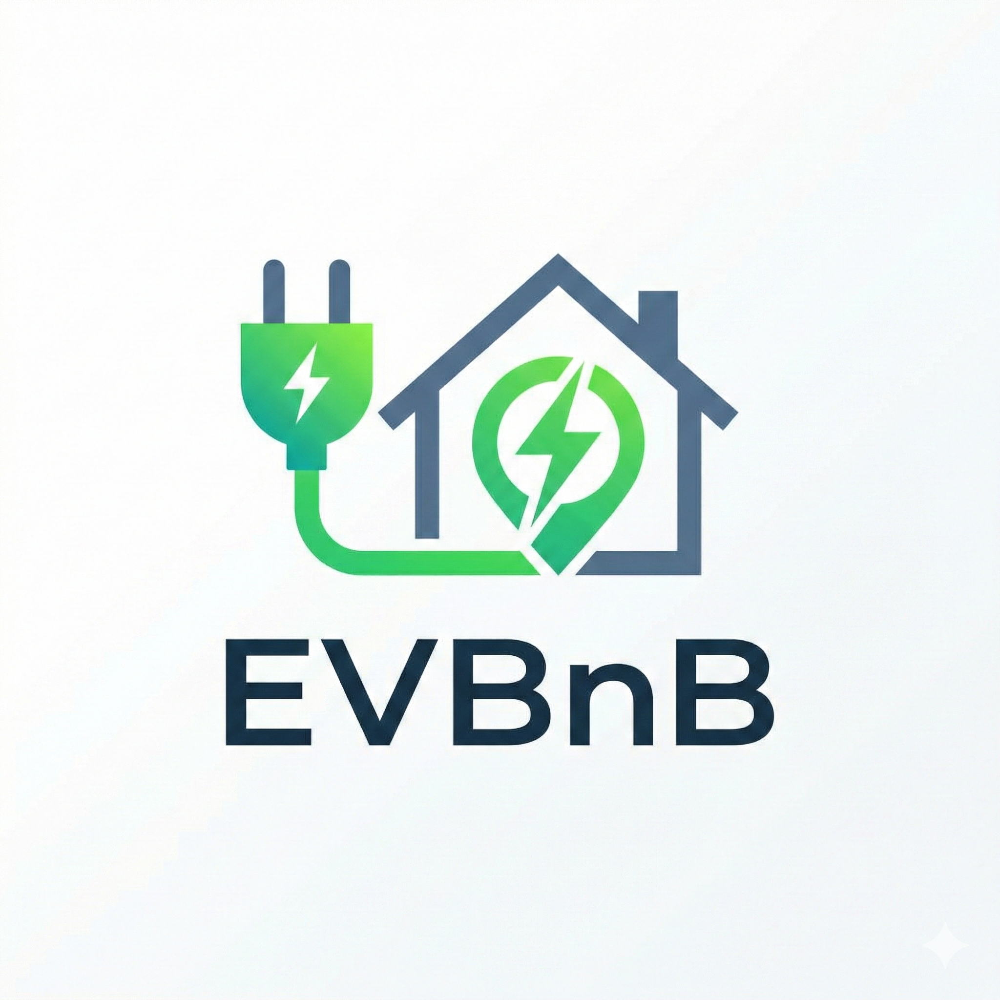
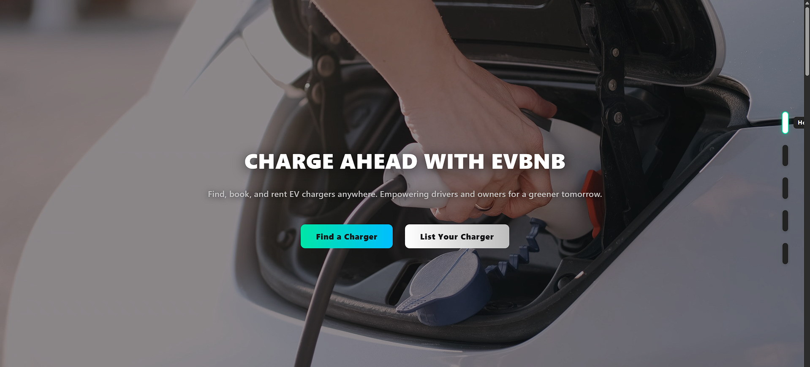
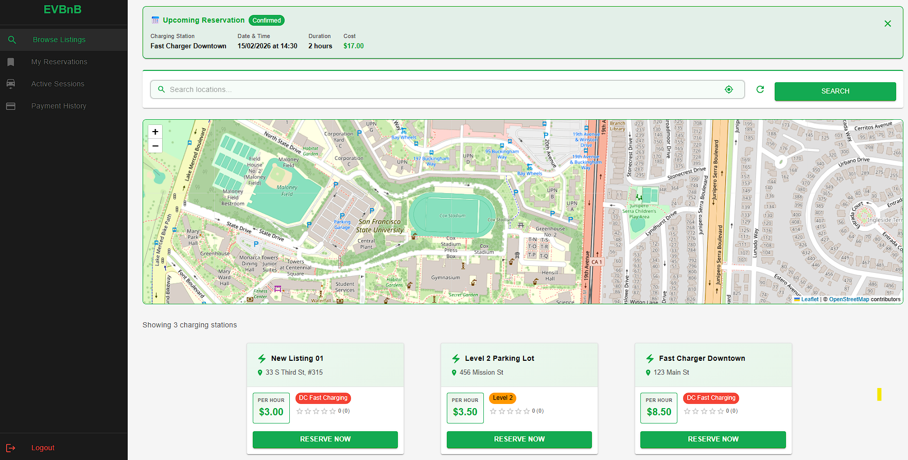
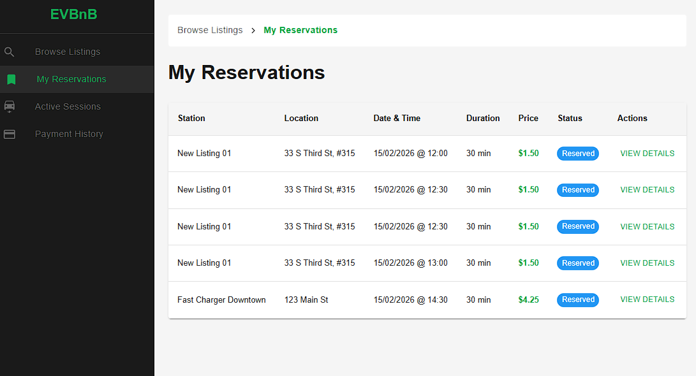
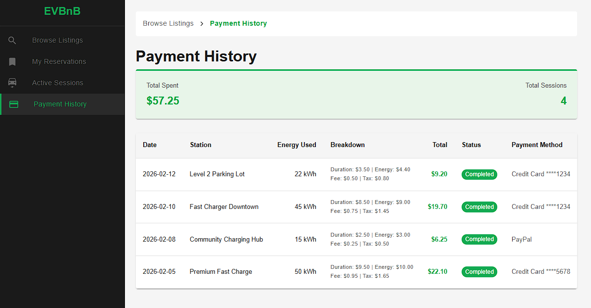
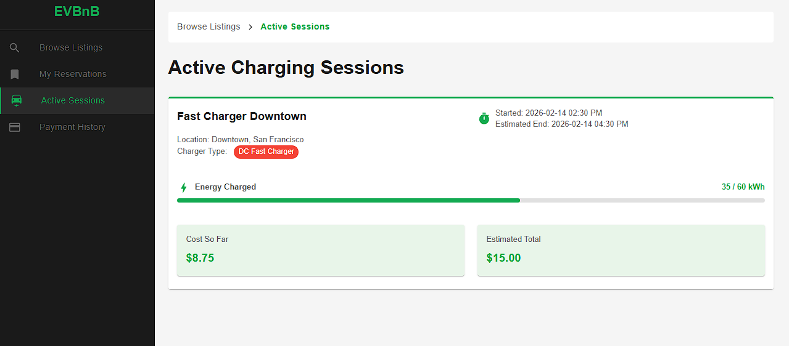
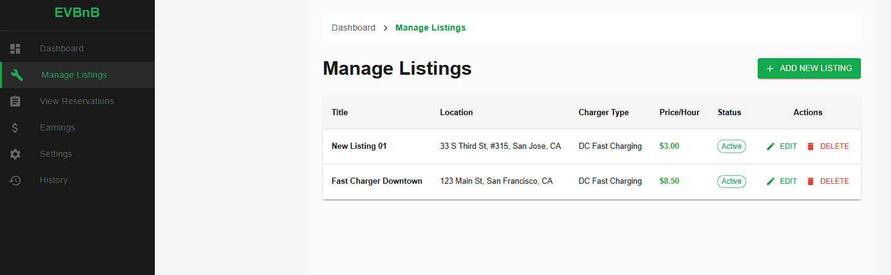
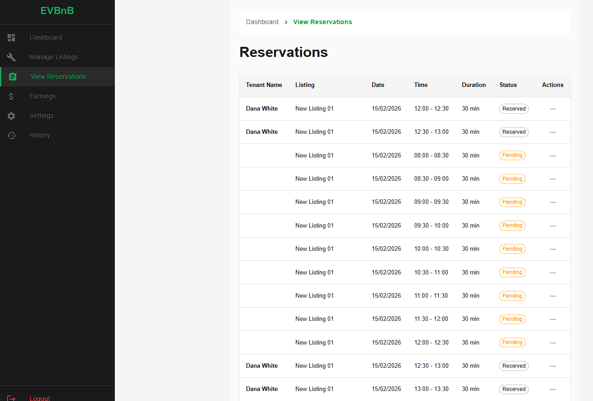
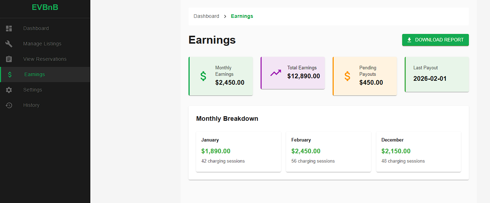

# EVBnB - EV Charging Station Rental Platform

<p align="center">
  
</p>

<p align="center">
  <strong>Share your EV charger. Charge anywhere. Earn while helping the planet.</strong>
</p>

<p align="center">
  <a href="#deployed-link">View Demo</a> •
  <a href="#features">Features</a> •
  <a href="#tech-stack">Tech Stack</a> •
  <a href="#quick-start">Quick Start</a>
</p>

---

## 🔗 Deployed Link

> **[Live Demo](#)** - https://youtu.be/XenX8vnUOwc

---

## 📖 About

**EVBnB** is a peer-to-peer EV charging station rental platform that connects electric vehicle owners with private charging station hosts. Think of it as "Airbnb for EV chargers" - homeowners can list their private EV chargers for rent when not in use, while EV drivers can find and book convenient charging spots near them.

The platform addresses the growing need for accessible EV charging infrastructure by leveraging underutilized private chargers, creating a win-win ecosystem where:
- **Charger Owners** earn passive income from their existing charging equipment
- **EV Drivers** get access to more charging options with competitive pricing
- **The Environment** benefits from increased EV adoption through better charging accessibility

---

## ✨ Features

### For EV Drivers (Tenants)
- 🔍 **Browse Listings** - Search and filter available charging stations by location, charger type, and price
- 🗺️ **Interactive Map** - View charging stations on an integrated map with real-time availability
- 📅 **Easy Reservations** - Book charging slots with flexible time selection
- ⚡ **Active Sessions** - Monitor ongoing charging sessions in real-time
- 💳 **Payment History** - View detailed transaction history with energy usage breakdown
- 📍 **Location-based Search** - Find chargers near you using GPS or manual location entry

### For Charger Owners
- 📝 **Manage Listings** - Create, edit, and delete charging station listings
- 📆 **Schedule Management** - Set availability schedules for your chargers
- 📊 **View Reservations** - Track all bookings and manage reservation statuses
- 💰 **Earnings Dashboard** - Monitor revenue with detailed earnings breakdown
- 📈 **Analytics** - View session statistics and download earning reports
- ⚙️ **Settings** - Configure account preferences and payout settings

### General Features
- 🔐 **User Authentication** - Secure login and signup for both owners and tenants
- 📱 **Responsive Design** - Works seamlessly on desktop and mobile devices
- 🎨 **Modern UI** - Clean, intuitive interface built with Material UI
- 🔄 **Real-time Updates** - Live status updates for sessions and reservations

---

## 🛠️ Tech Stack

### Frontend
| Technology | Purpose |
|------------|---------|
| **React 19** | UI Library |
| **TypeScript** | Type-safe JavaScript |
| **Vite** | Build tool & dev server |
| **Material UI (MUI)** | Component library |
| **React Router** | Client-side routing |
| **Leaflet** | Interactive maps |

### Backend
| Technology | Purpose |
|------------|---------|
| **Node.js** | Runtime environment |
| **Express.js** | Web framework |
| **MongoDB** | Database |
| **Mongoose** | ODM for MongoDB |
| **bcryptjs** | Password hashing |
| **CORS** | Cross-origin requests |

---

## 📸 Screenshots

### Landing Page

*Hero section with navigation to tenant and owner portals*

### Tenant - Browse Listings

*Search and filter available charging stations with map view*

### Tenant - My Reservations

*View and manage your upcoming and past reservations*

### Tenant - Payment History

*Detailed transaction history with energy usage and costs*

### Tenant - Active Sessions

*Monitor ongoing charging sessions in real-time*

### Owner - Add/Manage Listings

*Create and manage your EV charging station listings*

### Owner - View Reservations

*Track and manage all bookings for your charging stations*

### Owner - Earnings Dashboard

*Track your earnings with detailed breakdowns and reports*

---

## 🚀 Quick Start

### Prerequisites
- **Node.js** v18 or higher
- **MongoDB** (local instance or MongoDB Atlas)
- **npm** or **yarn**

### 1. Clone the Repository
```bash
git clone https://github.com/your-username/EVBnB.git
cd EVBnB
```

### 2. Backend Setup
```bash
# Navigate to backend directory
cd Backend

# Install dependencies
npm install

# Create environment file
cp .env.example .env

# Update .env with your MongoDB connection string
# PORT=5000
# MONGODB_URI=mongodb://localhost:27017/evbnb

# Start the server (development mode)
npm run dev
```

The backend server will start at `http://localhost:5000`

### 3. Frontend Setup
```bash
# Navigate to frontend directory (from root)
cd Frontend/EVBnB

# Install dependencies
npm install

# Start the development server
npm run dev
```

The frontend will be available at `http://localhost:5173`

### 4. Open in Browser
Navigate to `http://localhost:5173` to access the application.

---

## 📁 Project Structure

```
SFHacks2026/
├── Backend/
│   ├── index.js              # Express server entry point
│   ├── package.json
│   ├── controllers/          # Request handlers
│   │   ├── listingController.js
│   │   ├── reservationController.js
│   │   ├── scheduleController.js
│   │   ├── sessionController.js
│   │   ├── transactionController.js
│   │   └── userController.js
│   ├── models/               # MongoDB schemas
│   │   ├── Listing.js
│   │   ├── Reservation.js
│   │   ├── Schedule.js
│   │   ├── Session.js
│   │   ├── Transaction.js
│   │   └── User.js
│   └── routes/               # API route definitions
│       ├── listings.js
│       ├── reservations.js
│       ├── schedules.js
│       ├── sessions.js
│       ├── transactions.js
│       └── users.js
│
├── Frontend/
│   └── EVBnB/
│       ├── src/
│       │   ├── App.tsx           # Root component
│       │   ├── main.tsx          # Entry point
│       │   ├── components/       # Reusable components
│       │   │   ├── BreadcrumbNav.tsx
│       │   │   ├── MapComponent.tsx
│       │   │   ├── OwnerSidebar.tsx
│       │   │   └── TenantSidebar.tsx
│       │   ├── screens/          # Page components
│       │   │   ├── LandingPage.tsx
│       │   │   ├── LoginScreen.tsx
│       │   │   ├── Owner/        # Owner portal pages
│       │   │   └── Tenant/       # Tenant portal pages
│       │   └── theme/            # Theme configuration
│       └── public/               # Static assets
│
└── DataAnalysis/                 # Data analysis scripts
```

---

## 🔌 API Endpoints

| Resource | Base Route | Description |
|----------|-----------|-------------|
| Users | `/api/users` | User registration and authentication |
| Listings | `/api/listings` | EV charger listings CRUD |
| Reservations | `/api/reservations` | Booking management |
| Schedules | `/api/schedules` | Availability schedules |
| Sessions | `/api/sessions` | Active charging sessions |
| Transactions | `/api/transactions` | Payment records |

### Health Check
- `GET /api/health` - Server status
- `GET /api/ping` - Simple ping

---

## 🤝 Contributing

Contributions are welcome! Please feel free to submit a Pull Request.

1. Fork the repository
2. Create your feature branch (`git checkout -b feature/AmazingFeature`)
3. Commit your changes (`git commit -m 'Add some AmazingFeature'`)
4. Push to the branch (`git push origin feature/AmazingFeature`)
5. Open a Pull Request

---

## 📄 License

This project is licensed under the ISC License.

---

## 👥 Team

Built with ❤️ at SF Hacks 2026

---

<p align="center">
  <sub>Made for a greener future 🌱</sub>
</p>
